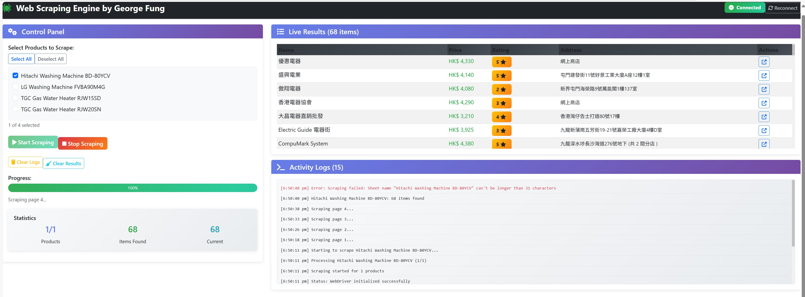

# Web Scraping Engine with Angular & Node.js

A comprehensive web scraping application with real-time WebSocket communication, built with Angular frontend and Node.js backend using Selenium WebDriver.

[](./images/screenshot.jpg)

## Features

- **Real-time WebSocket Communication**: Live updates during scraping process
- **Angular Frontend**: Modern, responsive UI with Bootstrap styling
- **Selenium WebDriver**: Automated browser control with Microsoft Edge
- **Product Selection**: Choose which products to scrape
- **Live Progress Tracking**: Real-time progress bars and statistics
- **Excel Export**: Automatically saves results to Excel files
- **Error Handling**: Comprehensive error handling and logging
- **Responsive Design**: Works on desktop and mobile devices

## Developer Information

**Name:** George Fung

**Email:** georgefungkp@gmail.com

**GitHub Username:** georgefungkp

**LinkedIn Profile:** https://www.linkedin.com/in/george-fung

## Project Structure

```
webscraping-app/
├── backend/
│   ├── server.js
│   ├── package.json
│   └── public/
├── frontend/
│   ├── src/
│   │   ├── app/
│   │   │   ├── app.component.ts
│   │   │   ├── app.component.html
│   │   │   ├── app.component.css
│   │   │   ├── app.module.ts
│   │   │   └── services/
│   │   │       └── web-scraping.service.ts
│   │   └── index.html
│   ├── package.json
│   └── angular.json
```

## Prerequisites

1. **Node.js** (v16 or higher)
2. **Angular CLI** (v16 or higher)
3. **Microsoft Edge Browser** (latest version)
4. **EdgeDriver** (compatible with your Edge version)

## Installation

### 1. Backend Setup

```bash
# Create backend directory
mkdir webscraping-app && cd webscraping-app
mkdir backend && cd backend

# Copy the server.js and package.json files
# Install dependencies
npm install

# Install EdgeDriver (if not already installed)
# Download from: https://developer.microsoft.com/en-us/microsoft-edge/tools/webdriver/
# Add EdgeDriver to your system PATH
```

### 2. Frontend Setup

```bash
# Go back to main directory and create frontend
cd ..
ng new frontend --routing=false --style=css
cd frontend

# Copy Angular files to appropriate locations:
# - app.component.ts to src/app/
# - app.component.html to src/app/
# - app.component.css to src/app/
# - app.module.ts to src/app/
# - web-scraping.service.ts to src/app/services/
# - Update src/index.html

# Install dependencies
npm install socket.io-client bootstrap
```

### 3. EdgeDriver Setup

1. Check your Microsoft Edge version: Go to `edge://version/`
2. Download the corresponding EdgeDriver from [Microsoft Edge WebDriver](https://developer.microsoft.com/en-us/microsoft-edge/tools/webdriver/)
3. Extract and add EdgeDriver to your system PATH
4. Verify installation: `msedgedriver --version`

## Running the Application

### 1. Start the Backend Server

```bash
cd backend
npm start
```

The server will start on `http://localhost:3000`

### 2. Start the Angular Frontend

```bash
cd frontend
ng serve
```

The frontend will be available at `http://localhost:4200`

## Usage

1. **Open the Application**: Navigate to `http://localhost:4200`
2. **Check Connection**: Ensure the "Connected" status is showing in the top navigation
3. **Select Products**: Choose which products you want to scrape from the product list
4. **Start Scraping**: Click the "Start Scraping" button
5. **Monitor Progress**: Watch real-time progress updates and live results
6. **View Results**: Check the activity logs and results summary
7. **Download Excel**: Results are automatically saved to Excel files in the backend directory

## Configuration

### Adding New Products

Edit the `urls` object in `server.js`:

```javascript
const urls = {
    New_Product: "https://www.price.com.hk/product.php?p=123456",
    // ... existing products
};
```

### Changing WebSocket Port

Update the port in both files:
- Backend: `server.js` - Change the `PORT` variable
- Frontend: `web-scraping.service.ts` - Update `serverUrl`

### Browser Configuration

To use a different browser, modify the WebDriver builder in `server.js`:

```javascript
// For Chrome
this.driver = await new Builder().forBrowser('chrome').build();

// For Firefox
this.driver = await new Builder().forBrowser('firefox').build();
```

## API Endpoints

### REST API
- `GET /api/status` - Server status
- `GET /api/products` - Available products list

### WebSocket Events

#### Client to Server:
- `start_scraping` - Start scraping process
- `stop_scraping` - Stop current scraping
- `get_products` - Request products list

#### Server to Client:
- `connected` - Connection confirmation
- `scraping_started` - Scraping process started
- `progress` - Progress updates
- `item_found` - New item discovered
- `product_complete` - Product scraping finished
- `scraping_complete` - All scraping finished
- `status` - Status messages
- `error` - Error messages

## Troubleshooting

### Common Issues

1. **EdgeDriver Not Found**
   ```
   Error: EdgeDriver not found in PATH
   ```
   **Solution**: Download and install EdgeDriver, add to system PATH

2. **Connection Failed**
   ```
   WebSocket connection failed
   ```
   **Solution**: Ensure backend server is running on port 3000

3. **CORS Issues**
   ```
   Access to XMLHttpRequest blocked by CORS policy
   ```
   **Solution**: Verify CORS configuration in server.js

4. **Port Already in Use**
   ```
   Error: listen EADDRINUSE :::3000
   ```
   **Solution**: Kill process using port 3000 or change PORT variable

### Performance Optimization

1. **Increase Scraping Speed**: Reduce `await this.driver.sleep()` delays
2. **Memory Management**: The application automatically manages WebDriver instances
3. **Concurrent Scraping**: Currently sequential - can be modified for parallel processing

## Security Considerations

- **Rate Limiting**: Add delays between requests to avoid being blocked
- **User Agents**: Consider rotating user agents for large-scale scraping
- **IP Rotation**: Implement proxy rotation for production use
- **Respect robots.txt**: Always check and respect website scraping policies

